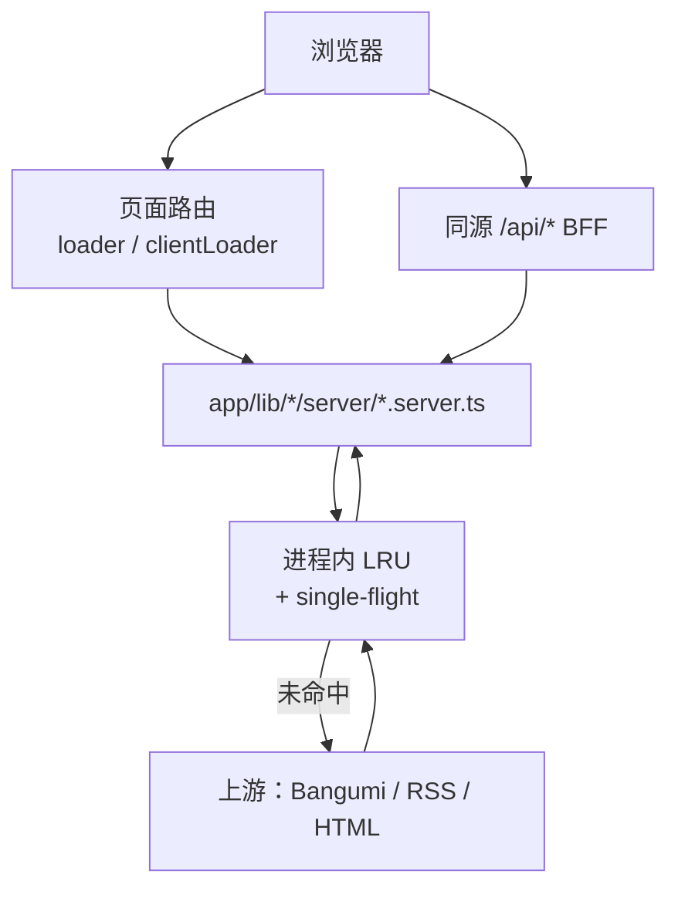
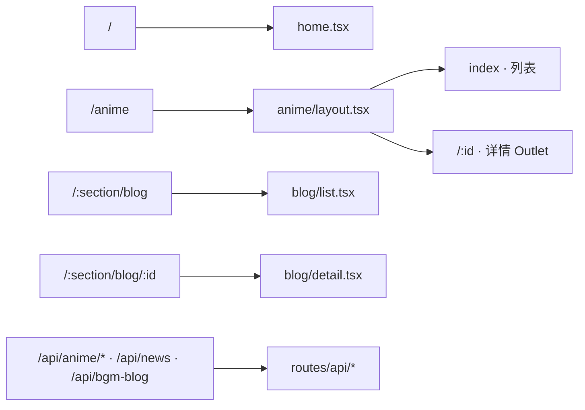
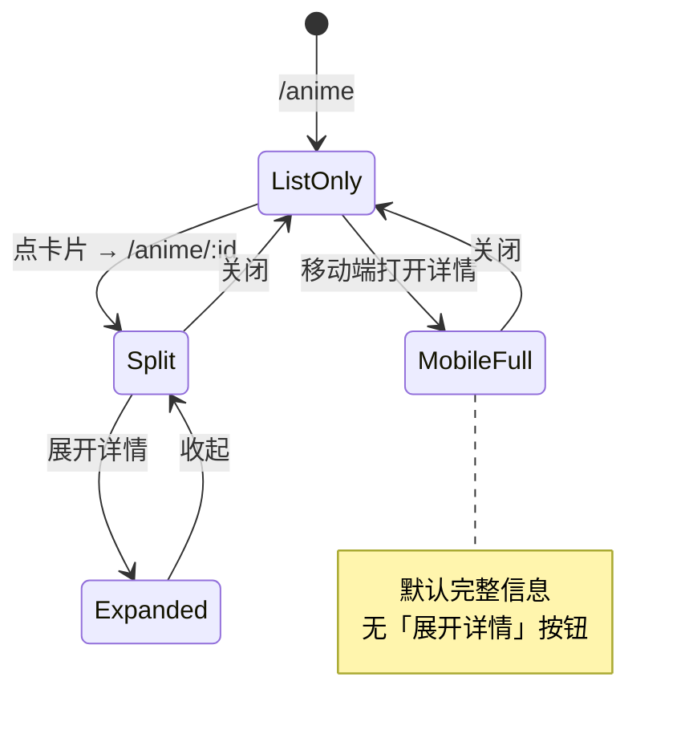
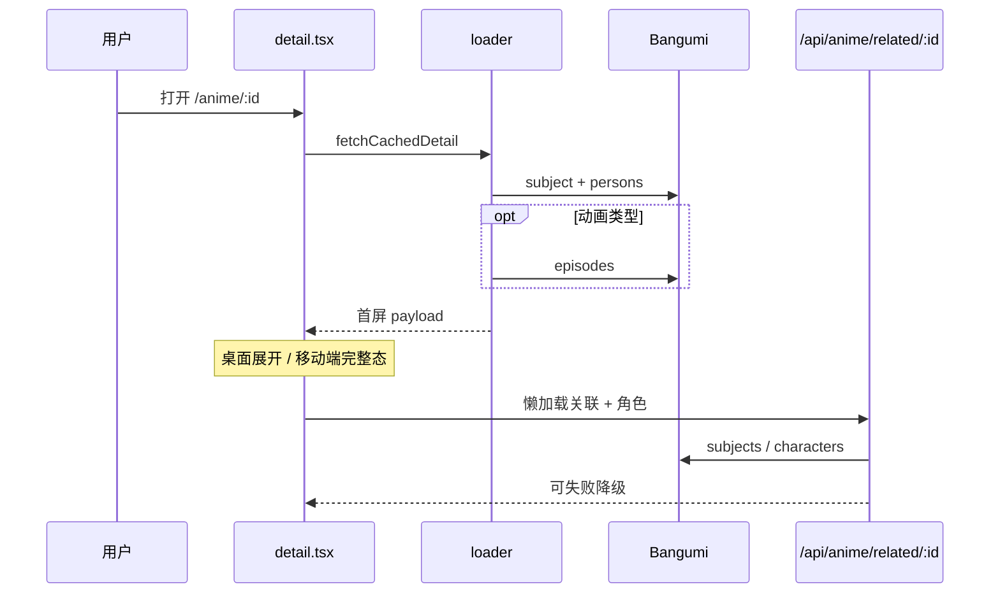
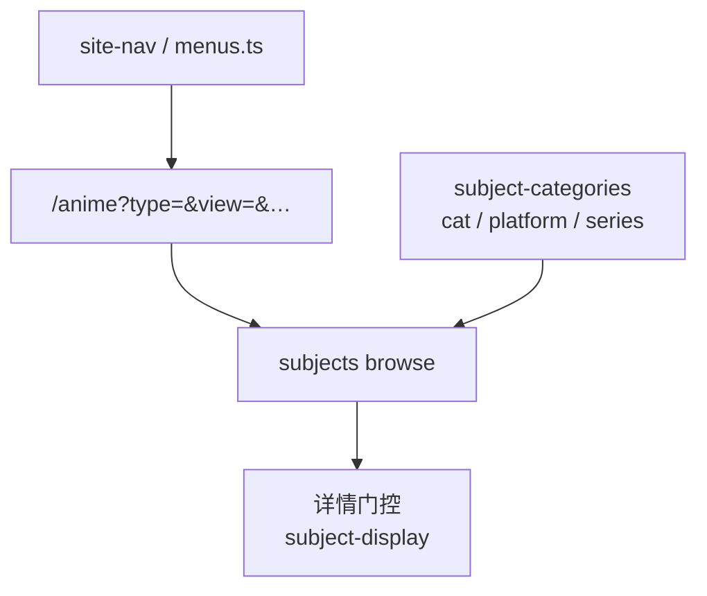
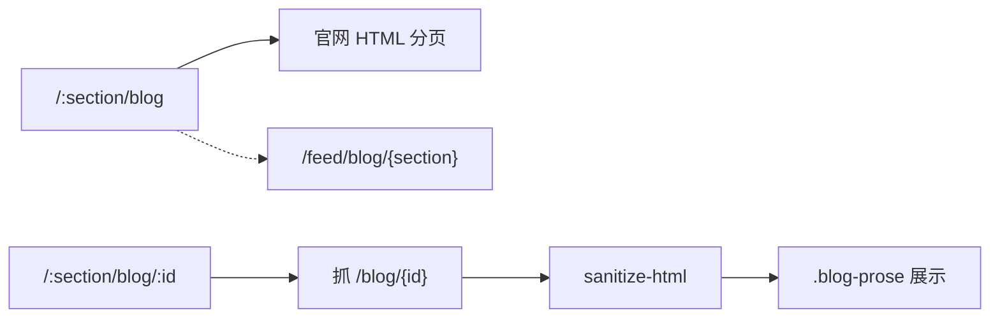
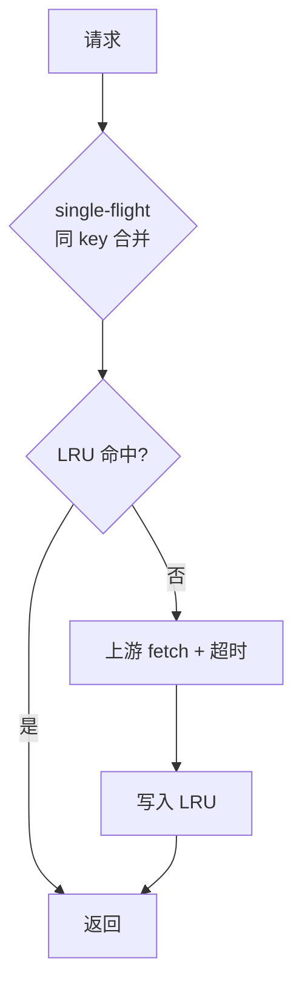
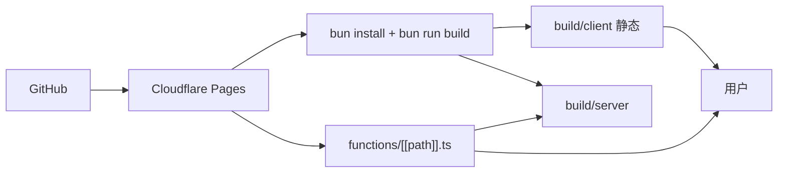

# 亚域空间 — 架构说明

> 描述当前代码的真实结构与数据流。最后更新：2026-08-20。  
> 早期产品设想见 [requirements.md](./requirements.md)（部分内容已过时，以本文为准）。

## 1. 总览

亚域空间是一个**只读**的 Bangumi 条目门户：列表浏览、分栏详情、多类型板块日志、首页资讯与日历卡片增强。不提供登录、收藏或任何需鉴权的 Bangumi 接口。

| 层       | 技术                                                         |
| -------- | ------------------------------------------------------------ |
| 应用框架 | React Router v7 Framework Mode（SSR + 客户端导航）           |
| UI       | React 19 · Tailwind CSS v4 · Base UI / shadcn 风格组件       |
| 包管理   | **Bun**（`bun.lock`）；生产运行在 Cloudflare Pages Functions |
| 上游     | Bangumi API / 官网 HTML·RSS · 资讯 RSS · B 站 / 下载检索跳转 |

### 请求分层



页面 loader 与 `/api/*` **共用**同一套 server 模块：字段裁剪、超时、可失败降级。

## 2. 路由地图

路由在 [`app/routes.ts`](../app/routes.ts) 显式注册（非纯文件约定）。



| 路径                                               | 模块                     | 说明                                             |
| -------------------------------------------------- | ------------------------ | ------------------------------------------------ |
| `/`                                                | `routes/home.tsx`        | 首页 Hero、搜索、资讯                            |
| `/anime` · `/anime/:id`                            | `routes/anime/*`         | 列表 + 详情分栏；query 决定类型与视图            |
| `/:section/blog`                                   | `routes/blog/list.tsx`   | 板块日志列表（`anime\|book\|music\|game\|real`） |
| `/:section/blog/:id`                               | `routes/blog/detail.tsx` | 日志详情（HTML 抓取 + 消毒）                     |
| `/api/anime/*` · `/api/news` · `/api/bgm-blog` | `routes/api/*`           | 同源 BFF                                         |

列表筛选一律进 URL query，用 `buildListHref` / `buildListUrl`（`app/lib/bangumi/params.ts`）生成，避免在 JSX 里手写路径。

> **注册顺序**：`/:section/blog` 必须写在 `/anime` 动态段之前，否则会被当成 `anime` 布局下的段。

## 3. 目录职责

```
app/
├── routes.ts                 # 路由表
├── routes/
│   ├── home.tsx
│   ├── anime/                # 布局 + 列表壳 + 详情 Outlet
│   ├── blog/                 # 多类型板块日志
│   └── api/                  # 同源资源路由
├── components/               # 业务 UI（日历卡、顶栏、日志卡片等）
│   └── ui/                   # 基础组件
└── lib/
    ├── bangumi/              # 类型、菜单、参数、展示文案
    │   └── server/           # 仅服务端：Bangumi / 博客抓取
    ├── cache/                # LRU + single-flight（可换边缘缓存）
    ├── downloads/ · news/ · bilibili/
    └── upstream.ts           # 超时 / Abort / 路由错误映射
```

约定：

- `*.server.ts` 只在 loader / 资源路由里用，客户端组件不要直接 import。
- 外网 `fetch` 必须带超时；Worker 环境不用 Node `fs` / jsdom。

## 4. 核心交互：列表 / 详情

[`app/routes/anime/layout.tsx`](../app/routes/anime/layout.tsx) 用 CSS Grid 列宽表达桌面三态；移动端有详情即全屏。



| 态           | 断点        | Grid 列宽   | 内容深度                         |
| ------------ | ----------- | ----------- | -------------------------------- |
| 仅列表       | 任意        | `1fr 0fr`   | —                                |
| 并排         | ≥ lg        | `1.6fr 1fr` | 概要 + 插件；展开后才有完整附加  |
| 桌面展开     | ≥ lg        | `0fr 1fr`   | 简介 / 章节 / 短评 / 关联等      |
| 移动全屏详情 | &lt; lg     | `0fr 1fr`   | **一步到位**完整信息             |

`isMobile` / `expanded` 经 Outlet context 下发。首屏仍可能有 hydration 后布局纠正，见 [013](./planning/013-mobile-hydration-layout.md)。

### 详情取数



职员字段按 `subject.type` 选取（`staff-by-type.ts`）。

## 5. 多类型条目与导航



- 列表共用 `/anime?type=`（动画 / 书籍 / 音乐 / 游戏 / 三次元）。
- 分类 / 平台 / 系列已接；**标签云暂缓**（见 [020](./planning/020-multi-type-subject-expansion.md)）。
- 非动画隐藏 B 站播放器、下载面板与动画向跳转。

## 6. 板块日志



| 能力 | 实现要点                                                                |
| ---- | ----------------------------------------------------------------------- |
| 分区 | `BlogSection`：`anime\|book\|music\|game\|real`                         |
| 列表 | HTML 分页为主；RSS 作辅                                                 |
| 详情 | 消毒；图片去固定宽高；`.blog-prose` 防手机横向溢出                      |
| 路由 | `/:section/blog` 须注册在 `/anime` 动态段之前                           |

## 7. 缓存与 BFF



- 进程内 `Map` LRU + single-flight（`app/lib/cache`）；设计上可换 Cloudflare KV / Cache API，**KV 尚未接**。
- 卡片增强：`/api/anime/cards` 批量补简介 / staff，日历避免 N+1。
- 上游失败：单块可降级，整页尽量不崩。

## 8. 部署



- `wrangler.toml`：`pages_build_output_dir = "./build/client"`
- 构建命令：`bun run build`（以 `bun.lock` 为准）

## 9. 相关文档

| 文档                                       | 用途                       |
| ------------------------------------------ | -------------------------- |
| [AGENTS.md](../AGENTS.md)                  | 给协作者 / Agent 的硬约定  |
| [planning/README.md](./planning/README.md) | 性能与工程优化项索引       |
| [bangumi-api.md](./bangumi-api.md)         | Bangumi API 调研           |
| [requirements.md](./requirements.md)       | 早期需求（历史）           |
