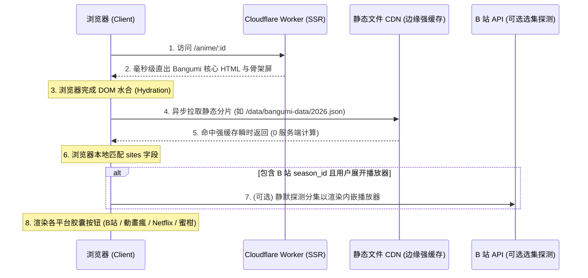

# 021：基于静态切片与客户端水合的流媒体与下载源分级聚合

## 元信息

| 字段 | 值 |
| --- | --- |
| 状态 | 已实施 |
| 优先级 | P1 |
| 类别 | 外部数据源 / 客户端水合 / 容灾降级 / 播放体验 |
| 证据置信度 | 高：B 站服务端搜索接口在海外机房易遭 412 风控拦截已确证；客户端静态 JSON 映射 0 服务端成本 |

## 问题摘要

目前番剧详情页中 B 站在线观看播放器（`BilibiliPlayer`）依赖 Cloudflare 服务端调用 B 站公开搜索 API（`searchBilibiliBangumi`）进行关键词匹配。由于 Cloudflare Pages/Workers 的海外机房 IP 缺乏合法用户登录态及动态 WBI 签名，极易触发 B 站服务端的 **HTTP 412 / code -412 风控拦截**，导致自动匹配失败，退化为仅提供关键词搜索跳转。

同时，若将全量第三方数据放在服务端 Worker 中处理，不仅会膨胀 Worker 构建产物、占用 Edge 运行时内存，还会为无状态的 SSR 带来额外的计算负担。

通过在构建期将社区开源的 [`bangumi-data`](https://github.com/bangumi-data/bangumi-data) 裁剪为**按年份分片的轻量静态 JSON**（存放于 `public/data/bangumi-data/`），并在详情页**水合（Hydration）后由浏览器异步拉取静态切片**，即可实现：
1. **服务端 0 负担**：服务端 Worker 不打包任何全量映射表，不发起任何外网爬取，SSR 首屏直出毫秒级完成。
2. **CDN 强缓存**：静态分片文件享受 Cloudflare CDN 边缘强缓存与浏览器本地缓存，后续访问 0 延迟。
3. **多平台正版选择**：利用条目精准 ID 模板化拼装 B 站、巴哈姆特動畫瘋、Netflix、爱奇艺、蜜柑计划等全网播放/资源直达链接，彻底根除风控。

## 客户端水合与分级数据流



## bangumi-data 的核心价值字段

`bangumi-data` 的典型单条数据结构：

```json
{
  "title": "勇者パーティを追い出された器用貧乏",
  "titleTranslate": {
    "zh-Hans": ["泛而不精的我被逐出了勇者队伍"],
    "zh-Hant": ["泛而不精的我被逐出了勇者隊伍"],
    "en": ["Jack-of-All-Trades, Party of None"]
  },
  "type": "tv",
  "lang": "ja",
  "officialSite": "https://kiyou-bimbou.com/",
  "begin": "2026-01-04T13:30:00.000Z",
  "broadcast": "R/2026-01-04T13:30:00.000Z/P7D",
  "end": "2026-03-18T15:30:00.000Z",
  "sites": [
    { "site": "bangumi", "id": "541336" },
    { "site": "bilibili", "id": "28236" },
    { "site": "gamer", "id": "144010" },
    { "site": "mikan", "id": "3819" },
    { "site": "crunchyroll", "id": "GT00366764" },
    { "site": "mal", "id": "61128" },
    { "site": "tmdb", "id": "tv/285166" }
  ]
}
```

## 平台模板映射表（纯客户端计算）

前端定义纯函数映射字典，直接本地拼接直达链接，不产生任何 API 请求：

| 平台 | `site` 标识 | 链接生成规则 | 说明 |
| :--- | :--- | :--- | :--- |
| **Bilibili 大陆** | `bilibili` | `https://www.bilibili.com/bangumi/media/md${id}` | 简中正版，支持分集与内嵌 |
| **巴哈姆特動畫瘋** | `gamer` | `https://ani.gamer.com.tw/animeVideo.php?sn=${id}` | 繁中正版，无删减 |
| **蜜柑计划** | `mikan` | `https://mikanani.me/Home/Bangumi/${id}` | 番剧专属下载专题与 RSS |
| **Netflix** | `netflix` | `https://www.netflix.com/title/${id}` | 全球流媒体直达 |
| **爱奇艺** | `iqiyi` | `https://www.iqiyi.com/a_${id}.html` | 国内正版 |
| **腾讯视频** | `tencent` | `https://v.qq.com/detail/${id}.html` | 国内正版 |
| **Crunchyroll** | `crunchyroll` | `https://www.crunchyroll.com/series/${id}` | 欧美主流流媒体 |

## 优化目标与非目标

### 目标

1. **零服务端消耗**：全量映射数据移至静态目录，由 CDN 托管，服务端 Worker 0 CPU/内存占用。
2. **多平台聚合呈现**：将单一的 B 站播放器升级为 `StreamingPlatformPanel`，支持多平台胶囊切换与直达。
3. **彻底隔离风控**：无论云端或本地网络状况如何，用户都能获得 100% 确定性的播放与资源链接。
4. **渐进式降级**：
   * **L1（静态切片命中）**：秒级呈现各平台官方直链与蜜柑专题。
   * **L2（动态选集增强）**：若 B 站 `season_id` 可用，可选探测选集渲染内嵌 Iframe。
   * **L3（关键词保底）**：若未收录，优雅展示带番剧名的搜索外链。

### 非目标

1. 在 SSR 阶段同步读取并阻塞 HTML 输出。
2. 跨域抓取各流媒体平台的未公开私有播放流。

## 实施计划

1. **静态分片生成脚本**：
   * 编写 `scripts/update-bangumi-data.ts`，从 `bangumi-data` 提取核心字段，按开播年份（如 `2026.json`、`2025.json`、`archive.json`）输出到 `public/data/bangumi-data/`。
   * 单个年份 JSON 经过 ID 键值压缩后体积仅数十 KB。
2. **客户端静态加载 Hook**：
   * 封装 `useBangumiData(subjectId, date)`，在组件 Mount 后发起静态 `fetch`，并通过客户端内存 Map 缓存已加载年份。
3. **UI 面板重构**：
   * 重构 `app/components/streaming-panel.tsx` 替代原先直接引用的 `BilibiliPlayer`。
   * 顶部提供平台选择胶囊栏（B站 / 動畫瘋 / 蜜柑 / Netflix 等），点击切换展示对应平台的直达卡片或选集播放器。
4. **下载面板联动**：
   * 在下载面板 `app/components/downloads-panel.tsx` 中同步注入蜜柑专属条目链接，优先于模糊文本搜索。

## 验证方法与验收标准

1. **性能验证**：
   * 检查服务端 bundle 体积无增加。
   * 静态 JSON 请求响应头包含强缓存，二次切页时 0 网络请求。
2. **功能与容灾验证**：
   * 访问当季新番（如 `541336`），水合完成后顺利展示 B 站、動畫瘋、蜜柑计划等多平台入口。
   * 模拟海外断网或 B 站 API 412 场景，页面各平台直链完全不受影响，无错误红字。

## 实施记录

- 开始日期：2026-08-21
- 完成日期：2026-08-21
- 最终方案：按年份静态分片（`public/data/bangumi-data/*.json`）+ 客户端水合后异步读取 + 内存 Map 缓存 + `StreamingPanel` 多平台正版胶囊聚合 + 蜜柑计划直达。
- 关键改动文件：
  - `scripts/update-bangumi-data.ts`
  - `package.json` (`data:bangumi`)
  - `app/lib/bangumi-data/types.ts`
  - `app/lib/bangumi-data/sites.ts`
  - `app/lib/bangumi-data/use-bangumi-data.ts`
  - `app/lib/bangumi-data/index.ts`
  - `app/components/streaming-panel.tsx`
  - `app/components/downloads-panel.tsx`
  - `app/routes/anime/detail.tsx`
- 与原推荐方案的差异：无差异，完全采用纯客户端静态切片水合模式。

## 验证结果

- [x] 类型检查通过（`bun run typecheck`）
- [x] 生产构建通过（`bun run build`，服务端体积 0 膨胀）
- [x] 静态按年分片数据生成正常（共 8725 部番剧，18 个分片）
