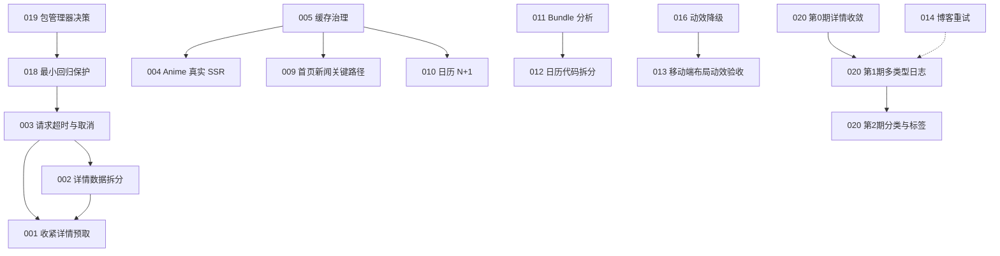

# 项目优化规划索引

本目录记录当前项目中已经识别、但尚未实施的性能、可靠性和工程质量改进项。

这里采用“**一个问题一个文件**”的方式，目的是让每项改动都可以单独理解、讨论、实施和验收，而不是把所有建议混在一份难以维护的长文档中。

> 当前阶段只记录问题和方案，没有实施业务代码修改。每次真正开始一个任务时，应先重新确认代码现状和基线，避免文档与后续代码变化脱节。

## 如何使用这些文档

建议每次只选择一个编号推进：

1. 阅读该项的“问题摘要”和“工作原理”；
2. 核对“当前证据”是否仍与代码一致；
3. 完成文档要求的实施前基线；
4. 在候选方案中做出决策，并记录为什么选择它；
5. 按步骤实施，避免顺带修改无关问题；
6. 执行“验证方法”和“验收标准”；
7. 更新状态、测量结果和最终决策。

每份文档统一包含：

- 元信息与证据置信度；
- 问题摘要；
- 当前代码证据；
- 工作原理与影响；
- 优化目标与非目标；
- 多种方案比较；
- 推荐方案；
- 分步骤实施计划；
- 风险与取舍；
- 验证方法与验收标准；
- 依赖关系与学习要点。

## 状态约定

| 状态     | 含义                                   |
| -------- | -------------------------------------- |
| 待实施   | 已记录问题，尚未开始代码修改           |
| 测量中   | 正在建立基线或验证问题严重程度         |
| 方案确认 | 已选择实施方案，尚未开始或正在准备     |
| 实施中   | 正在修改代码                           |
| 待验证   | 代码已完成，等待性能与回归验证         |
| 已完成   | 已通过验收，并记录了前后对比           |
| 暂缓     | 已知问题，但当前收益不足或缺少前置条件 |
| 不采纳   | 已评估并记录了不实施的理由             |

状态不应只表示“代码写完”。只有达到文档中的验收标准，才能标记为“已完成”。

## 优先级约定

| 优先级 | 含义                                             |
| ------ | ------------------------------------------------ |
| P0     | 请求放大、长时间阻塞或稳定性风险，应优先处理     |
| P1     | 对核心体验、首屏、部署可靠性或回归保护有明显价值 |
| P2     | 有明确优化方向，但应先测量收益或等待前置工作     |
| P3     | 低风险清理、可维护性改进或需要团队决策的事项     |

优先级表示当前建议顺序，不等于所有 P0 都必须一次完成。某些文档内部也会拆成不同优先级的子任务。

## 当前构建基线

以下数据来自本次审查时执行的生产构建，只作为规划快照。实施任何优化前应使用相同依赖和命令重新测量。

| 指标                  |                                                当前观测 |
| --------------------- | ------------------------------------------------------: |
| `build/client` 总大小 |                                               约 9.4 MB |
| 客户端 JS             |     26 个文件，555,039 bytes raw，约 180,221 bytes gzip |
| 客户端 CSS            |                 220,675 bytes raw，约 73,761 bytes gzip |
| 字体产物              |                              210 个文件，约 7.36 MB raw |
| 首页 Hero             | 1,166,539 bytes，1024×1024，扩展名 `.png` 但实际为 JPEG |
| `site-nav` chunk      |                 112,730 bytes raw，约 37,682 bytes gzip |

注意：

- 字体构建总量不等于单个用户会下载全部字体；`unicode-range`、格式选择、页面字符和缓存都会影响实际传输量。
- 所有 JS chunk 总量不等于单个路由首屏下载量；必须结合 manifest、bundle analyzer 和浏览器 Network 面板分析。
- 文件大小只能说明优化机会，不能直接证明 LCP、INP 或 TTFB 已经受到相同比例的影响。

本次基础验证：

```text
npm run typecheck  通过
npm run build      通过
npm ls --depth=0   通过
```

项目目前没有正式的 `test` 或 `lint` 脚本，相关规划见 [018](./018-testing-and-lint.md)。

## 问题总表

| 编号                                             | 主题                         | 优先级 | 状态             | 核心价值                                              |
| ------------------------------------------------ | ---------------------------- | ------ | ---------------- | ----------------------------------------------------- |
| [001](./001-card-viewport-prefetch.md)           | 控制卡片视口预取成本         | P0     | 待验证           | 避免列表浏览触发大量昂贵详情请求                      |
| [002](./002-detail-request-waterfall.md)         | 消除详情可选请求瀑布         | P0     | 待验证           | 降低详情尾延迟并隔离第三方故障                        |
| [003](./003-bangumi-timeout-and-cancellation.md) | Bangumi 超时与取消传播       | P0     | 已实施           | 避免核心请求无限等待和无效占用                        |
| [004](./004-anime-real-ssr.md)                   | Anime 列表真实 SSR           | P1     | 已实施           | 缩短首屏数据路径并改善无 JS/SEO 能力                  |
| [005](./005-cache-bounds-and-single-flight.md)   | 有界缓存与 Single-flight     | P1     | L1+L2 已实施     | 控制内存并减少缓存击穿和重复回源                      |
| [006](./006-font-payload.md)                     | 字体负载精简                 | P2     | 方案 A 已实施    | 减少 CSS、部署资源和实际字体请求                      |
| [007](./007-hero-image.md)                       | Hero 图片优化                | P1     | 方案 B 已实施    | 低成本减少首屏约 1.1 MiB 图片浪费                     |
| [008](./008-cover-loading.md)                    | 封面优先级与响应式图片       | P1     | A+B 已实施       | 避免过多高优先级大图竞争网络                          |
| [009](./009-home-news-critical-path.md)          | 新闻退出首页关键路径         | P1     | 待实施           | 避免下方第三方内容阻塞首页 SSR                        |
| [010](./010-calendar-n-plus-one.md)              | 日历卡片 N+1 请求            | P1     | 方案 B 已实施    | 降低 API 数量、Function 调用和上游压力                |
| [011](./011-site-nav-bundle.md)                  | SiteNav Bundle 优化          | P2     | 暂缓             | 分析后：大头是 Select+Floating UI，单换菜单收益不足   |
| [012](./012-calendar-code-splitting.md)          | 日历代码按需拆分             | P2     | 暂缓             | 分析后：非日历约可省数 KiB～9 KiB gzip，暂不整体 lazy |
| [013](./013-mobile-hydration-layout.md)          | 移动端 hydration 后布局切换  | P2     | 待实施           | 提升首屏视觉稳定性并简化响应式逻辑                    |
| [014](./014-blog-retry-and-infinite-list.md)     | 博客重试与无限列表           | P1/P2  | 重试已修         | 重试随 020 落地；长列表窗口化仍可后置                 |
| [015](./015-detail-deep-clone.md)                | 详情深克隆优化               | P3     | 待实施           | 减少不必要序列化并提高数据处理可读性                  |
| [016](./016-blur-animation-motion.md)            | 模糊与动效降级               | P2     | 待实施           | 改善 reduced-motion 与低性能设备体验                  |
| [017](./017-cloudflare-env.md)                   | Cloudflare 环境变量读取      | P1     | 待实施           | 提高生产配置可靠性和可测试性                          |
| [018](./018-testing-and-lint.md)                 | 测试与 Lint 基础设施         | P1     | 待实施           | 为后续逐项优化建立回归保护                            |
| [019](./019-package-manager-lockfile.md)         | 包管理器与锁文件统一         | P3     | 待实施           | 保证本地、CI 和部署依赖可复现                         |
| [020](./020-multi-type-subject-expansion.md)     | 对齐官网多类型导航与板块日志 | P1/P2  | 第 0～2 期已完成 | 日志+分类/平台已通；标签暂缓；第 3 期可选             |

## 推荐推进顺序

### 第一阶段：控制风险和建立保护

1. [018 测试与 Lint 基础设施](./018-testing-and-lint.md)：先为纯函数和关键错误路径建立最小保护，不要求一次搭完整体系。
2. [003 Bangumi 超时与取消传播](./003-bangumi-timeout-and-cancellation.md)：建立统一网络边界。
3. [001 卡片视口预取](./001-card-viewport-prefetch.md)：先把 `viewport` 收紧为 `intent`，这是低改动高收益步骤。
4. [002 详情请求瀑布](./002-detail-request-waterfall.md)：先并行，再决定是否拆成独立面板请求。
5. [014 博客重试](./014-blog-retry-and-infinite-list.md)：先修复确定性功能 bug，长列表治理可以后置。

### 第二阶段：重整数据路径和缓存

1. [005 缓存治理](./005-cache-bounds-and-single-flight.md)。
2. [004 Anime 真实 SSR](./004-anime-real-ssr.md)。
3. [009 首页新闻关键路径](./009-home-news-critical-path.md)。
4. [010 日历 N+1](./010-calendar-n-plus-one.md)。
5. [017 Cloudflare 环境变量](./017-cloudflare-env.md)。

### 第三阶段：静态资源与客户端负载

1. [007 Hero 图片](./007-hero-image.md)。
2. [008 封面加载](./008-cover-loading.md)。
3. [006 字体负载](./006-font-payload.md)。
4. [011 SiteNav Bundle](./011-site-nav-bundle.md)。
5. [012 日历代码拆分](./012-calendar-code-splitting.md)。

### 第四阶段：体验打磨与工程一致性

1. [013 移动端布局](./013-mobile-hydration-layout.md)。
2. [016 动效降级](./016-blur-animation-motion.md)。
3. [015 详情深克隆](./015-detail-deep-clone.md)。
4. [019 包管理器与锁文件](./019-package-manager-lockfile.md)。

### 产品扩展（可与性能项并行）

1. [020 对齐官网多类型导航与板块日志](./020-multi-type-subject-expansion.md)：**优先第 1 期各类型日志**（与动画日志同构）；分类/标签随后；不做人物/小组整站搬迁。
2. 建议与 [014](./014-blog-retry-and-infinite-list.md) 一并考虑（泛化日志时修重试）。
3. 每完成一期，在 020 文末「分期实施记录」记账后再开下一期。

该顺序不是强制流程。`007` 和 `014` 的第一阶段都较独立，可以在任何时间先实施。

## 主要依赖关系



其中存在一个可灵活处理的关系：`019` 从长期看应先于 CI 固化，但不应阻止 `018` 先用当前 README 已采用的 npm 建立最小测试脚本。等维护者明确包管理器后，再统一 CI 与锁文件。

## 每项实施后的记录模板

完成一个问题时，建议在对应文件末尾追加以下内容：

```md
## 实施记录

- 开始日期：
- 完成日期：
- 最终方案：
- 关键改动文件：
- 与原推荐方案的差异：
- 差异理由：

## 前后对比

| 指标     | 修改前 | 修改后 | 测试环境 |
| -------- | -----: | -----: | -------- |
| 示例指标 |        |        |          |

## 验证结果

- [ ] 类型检查通过
- [ ] 相关单元/集成测试通过
- [ ] 生产构建通过
- [ ] 浏览器关键路径回归通过
- [ ] 性能指标达到验收标准
- [ ] 无已知未记录回归

## 最终结论

记录实际收益、未解决问题，以及是否需要创建新的后续规划。
```

## 维护原则

- 不把静态推断写成已经测得的线上事实。
- 不只记录“应该改什么”，也记录为什么、代价和不改的条件。
- 一个提交尽量只实施一个编号，便于理解、回滚和对比。
- 优化前先测量，优化后用相同环境复测。
- 如果收益小于复杂度，可以把状态改为“暂缓”或“不采纳”；这也是有效的工程决策。
- 代码变化导致证据行号失效时，应在实施该项时同步更新文档。
